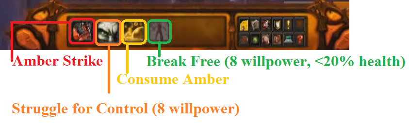

# [Amber-Shaper Un'Sok](<https://www.wowhead.com/mop-classic/guide/raids/amber-shaper-unsok-heart-of-fear-strategy-abilities>)
*Video guides*
- *[WowHead](<https://www.youtube.com/watch?v=82s_NAFlKLw>)*
- *[Fatboss](<https://www.youtube.com/watch?v=UzfCS6_bYEA>)*

This boss will summon 3 types of adds: [Constructs](#mutated-construct-construct), [Ambers](#living-amber-amber), and a [Monstrosity](#amber-monstrosity-monstrosity).

A core component of this boss is using the vehicle controls of the [Mutated Construct](#mutated-construct), which everyone will experience being inside of at some point. During phase 3, there will no longer be an escape mechanic from the vehicle.
#### [Mutated Construct](<https://www.wowhead.com/mop-classic/npc=62701/mutated-construct>) *(Construct)*

Mutated Construct has 2 resources, its health and its willpower (You can think about it like energy). 

The vehicle starts with 100 willpower and loses 2 willpower per second. Giving you a max of 50 sec in the vehicle without [consuming](#consume-amber) a [pool](#burning-amber) or casting [Struggle for Control](#struggle-for-control). Assuming that you will need to cast [Struggle for Control](#struggle-for-control) every 10 seconds, [***you can stay in your construct for 34 seconds***](<MonstrousConstructWillpower.md>).

If you reach 0 willpower, you die and the vehicle becomes sentient as an additional add. An ***Uncontrolled Construct***

- ##### [Amber Strike](<https://www.wowhead.com/mop-classic/spell=122389/amber-strike>)
  - #1
  - Strike which deals 350k damage to target
  - 6 sec cooldown
  - Applies [Destabilize](#destabilize) to target
  - Interrupts [Monstrosity](#amber-monstrosity-monstrosity) casting [Amber Explosion](#amber-explosion-1)
  - Strat:
    - Phase 1: Spam on cooldown
    - Phase 2: Only use to interrupt the [Monstrosity](#amber-monstrosity-monstrosity)'s [Amber Explosion](#amber-explosion-1). It is the top priority, above even [Struggle for Control](#struggle-for-control).
    - Phase 3: Only stop spamming to top up your willpower

- ##### [Struggle for Control](<https://www.wowhead.com/mop-classic/spell=122395/struggle-for-control>)
  - #2
  - Stuns the vehicle for 0.5 sec
  - Vehicle takes 100% more damage for 5 sec
  - Expends 8 Willpower
  - Strat:
    - Driver: Use this ability to interrupt [Amber Explosion](#amber-explosion). 
      - ***This is priority, only behind interrupting [Monstrosity](#amber-monstrosity-monstrosity)'s [Amber Explosion](#amber-explosion-1)***

- #### [Consume Amber](<https://www.wowhead.com/mop-classic/spell=123156/consume-amber>)
  - #3
  - When touching a [pool](#burning-amber-pool), restore 20 willpower
  - Heals Vehicle for 2.1m Health
  - Consumes the [pool](#burning-amber-pool)

- ##### [Break Free](<https://www.wowhead.com/mop-classic/spell=123060/break-free>)
  - #4
  - Exits the vehicle
  - Requires the vehicle to be <20% health
  - Costs 8 Willpower
  - Strat:
    - Use this at or before you are at 10 Willpower

- ##### [Smash](<>)
  - Melee attack doing 120k damage
  - This is your auto-attack
  - Strat:
    - Right click on the boss and stay in range for this to continue

- ##### [Amber Explosion](<https://www.wowhead.com/mop-classic/spell=122398/amber-explosion>)
  - Cast made by the vehicle itself, it will start doing this with or without player action.
  - 2.5 sec cast
  - 175k Raid damage
  - Can be interrupted by [Struggle for Control](#struggle-for-control)
  - Strat:
    - Everyone: Interrupted this every time with [Struggle for Control](#struggle-for-control)

- ##### [Destabilize](<https://www.wowhead.com/mop-classic/spell=123059/destabilize>)
  - Debuff which increases damage done to target by 10% for 15 sec
  - This effect stacks
    - (I don't know what the cap on stacks is, assume it is unattainable)
  - Strat:
    - Keep this up on Amber-Shaper for the entire fight. This is the skill which will dramatically increase the rate at which you move through this fight.

- #### Strategy/priority List when inside the [Construct](#mutated-construct-construct):
  - Stay in melee range to continue [smashing](#smash)
  - Mind your willpower, you need 8 to use [Break Free](#break-free), 
    - ***never let your willpower drop below 10***.
  - Be below 20% health.
    - When you are above 20% health, communicate that to the raid. Raid lead will direct dps to you. If he doesn't communicate again, until he at least acknowledges.
    - "My construct is above 20"
    - "My willpower is low, I need my health down"
  - Use [Amber Strike](#amber-strike) on cooldown
    - During [phase 2](#phase-2) this is kept in reserve to interrupt the [Monstrosity](#amber-monstrosity-monstrosity)'s [Amber Explosion](#amber-explosion-1)
  - Use [Struggle for Controll](#struggle-for-control) when your vehicle begins casting [Amber Explosion](#amber-explosion)
  - Spam [Smash](#smash)

## Phase 1
Phase ends when Amber-Shaper gets to 70% health

This phase is just the Amber-Shaper and the [Living Amber](#living-amber) created by his [Amber Scalpel](#amber-scapel).

We're focusing damage on the boss, tanks are stacking [Destabilize](#destabilize), and killing [Ambers](#living-amber-amber).

### Phase 1 Mechanics
- #### [Amber Scalpel](<https://www.wowhead.com/mop-classic/spell=1245000/amber-scalpel>)
  - Slow moving laser which fixates random player
  - lasts for 10 sec
  - 40 sec cooldown
  - Does 90k dps
  - Drops Molten Amber Residue (residue) on ground which will disipate eventually
    - Residue do continuous damage - 40k dps - to players who touch it
    - Residues occasionally spawn [Living Amber](#living-amber).

- #### [Living Amber](<https://www.wowhead.com/mop-classic/npc=248104/living-amber>) *(Amber)*

  - Add spawned from pool left behind [Amber Scalpel](#amber-scalpel)
  - Fixates on a random player
  - Aura does 1.5k dps to raid
  - Explodes when it dies doing:
    - 70k damage to players within 8 yards
    - Healing to Amber Creatures (including [Ambers](#living-amber) and [Constructs](#mutated-construct), and possible the [Monstrosity](#amber-monstrosity-monstrosity)) 40% of max health
  - Leaves a [pool](#burning-amber), when it dies.

  - Strat:
    - Target: kite the add away from melee, avoid letting it hit you.
    - Ranged: These are DPS priority. If one is targetting a healer, it becomes TOP priority.
    - Raid Lead: call out priority change "Ambers are up, ranged focus", "Amber on Heals, marked skull, range focus"

- #### [Burning Amber](<https://www.wowhead.com/mop-classic/spell=123020/burning-amber>) *(pool)*
  - a pool which does 45k dps when touching it or within 3 yards
  - Can be picked up by [Mutated Construct](#mutated-construct) for healing
  - Strat:
    - Everyone: leave these alone until phase 3
    - Everyone: Stay at least 3 yards away

- #### [Parasitic Growth](<https://www.wowhead.com/mop-classic/spell=121949/parasitic-growth>)
  - DoT, 12k dps, 30 sec
  - Damage scales with healing received
  - Strat:
    - Healers: top up character when targetted
    - Healers & Target: Shield character
    - Healers & Target: Avoid healing the target unless necessary

- #### [Reshape Life](<https://www.wowhead.com/mop-classic/spell=122370/reshape-life>)
  - Transforms a character into a [Mutated Construct](#mutated-construct)
  - In phase 1, this only happens to the tank
  - Can be healed by [Living Amber](#living-amber)'s death explosion.
  - Strat:
    - DPS: Prioritize dropping [Construct](#mutated-construct) to below 20% health immediately before swapping back to the boss.
    - Raid Lead: call out priority change: "Construct up, swap dps to construct", "Stop dps, swap back to boss"
    - If Construct catches a [Living Amber](#livin]g-amber) explosion, it needs to be dropped below 20% again. Then, follow the above strats.
    - Tanks: follow [priority algorithm](#strategypriority-list-when-inside-the-construct) for [Construct](#mutated-construct) above.
    - Tanks: drop out of [Construct](#mutated-construct) before the current active tank is transformed. You cannot tank the boss as a [Construct](#mutated-construct), they take additional damage from the boss.

- #### [Destroy Will](<https://www.wowhead.com/mop-classic/spell=124824/destroy-will>)
  - When the boss hits a [Construct](#mutated-construct-construct), it removes 40 willpower as well as the damage.
  - Strat: Do not be the target of the boss if you are in the vehicle.

### Phase 1 Strategy:
- Everyone: Avoid damage from [laser](#amber-scalpel)
  - Immediately run out of the raid, trying to drop the residue from the laser on the side.
- DPS priority: [Construct](#mutated-construct-construct) until it is below 20%
  - This will be called out by the raid lead
- Everyone: When you are fixated by an [amber](#living-amber-amber), run it out.
- Ranged priority: [Ambers](#living-amber-amber)
  - Top priority to an [amber](#living-amber-amber) that is targetting a healer.
  - Do not kill an [amber](#living-amber-amber) in or adjacent to the melee stack
- Tanks:
  - Spam [Amber Strike](#amber-strike) when in the [construct](#mutated-construct-construct)
  - Interrupt [Amber Explosion](#amber-explosion) with [Struggle for Control](#struggle-for-control)
  - [Break Free](#break-free) at or before 10 willpower

This strategy will let the stacks of [Destabilize](#destabilize) fall off in between [Reshape Life](#reshape-life), but it is a lot simpler until we get a better handle on it. We need to get a lot more clean with tank transitions before we can do that.
- Later on, we'll have the tanks [consume](#consume-amber) a [pool](#burning-amber-pool) after 2 [Amber Strike](#amber-strike)s to get their willpower up, and only then dps them down.

## Phase 2
The boss gets 1 new ability, but otherwise has all the same abilities as the previous phase. Now anyone can be targetted by [Reshape Life](#reshape-life).

The boss summons the [Monstrosity](#amber-monstrosity-monstrosity). This phase continues until the [Monstrosity](#amber-monstrosity-monstrosity) is killed.

The [Monstrosity](#amber-monstrosity-monstrosity) replaces the boss as the default dps target.

### Phase 2 Mechanics

- #### [Amber Carapce](<https://www.wowhead.com/mop-classic/spell=122540/amber-carapace>)
  - Boss gets a 99% damage reduction until [Monstrosity](#amber-monstrosity-monstrosity) is destroyed
  - Strat:
    - The boss is not a dps target this phase except to cleave into.

- #### [Amber Monstrosity](<https://www.wowhead.com/mop-classic/npc=62711/amber-monstrosity>) *(Monstrosity)*
   
  
  *It looks the same as the [Construct](#mutated-construct-construct), just bigger.*

  - #### [Amber Explosion](https://www.wowhead.com/mop-classic/spell=122402/amber-explosion)
    - 225k raid damage
    - 50 sec cooldown
    - Interruptable by [Amber Strike](#amber-strike)
    - Strat:
      - Interrupting this is the #1 priority

  - #### [Massive Stomp](<https://www.wowhead.com/mop-classic/spell=122408/massive-stomp>)
    - 
    - Strat:
  
  - #### [Fling](<https://www.wowhead.com/mop-classic/spell=122413/fling>)
    - 
    - Strat:

### Phase 2 Strategy:
- Everyone: Avoid damage from [laser](#amber-scalpel)
  - Immediately run out of the raid, trying to drop the residue from the laser on the side.
- DPS priority: [Construct](#mutated-construct-construct) until it is below 20%
  - This will be called out by the raid lead
- Everyone: When you are fixated by an [amber](#living-amber-amber), run it out.
- Ranged priority: [Ambers](#living-amber-amber)
  - Top priority to an [amber](#living-amber-amber) that is targetting a healer.
  - Do not kill an [amber](#living-amber-amber) in or adjacent to the melee stack
- [Construct](#mutated-construct-construct) Pilots:
  - Save [Amber Strike](#amber-strike) for the [Monstrosity](#amber-monstrosity-monstrosity)'s [Amber Explosion](#amber-explosion-1)
  - Interrupt your [Amber Explosion](#amber-explosion) with [Struggle for Control](#struggle-for-control)
  - [Break Free](#break-free) at or before 10 willpower
- Everyone: DPS the [Monstrosity](#amber-monstrosity-monstrosity)

## Phase 3
This is the burn phase. It will become functionally impossible to damage a [Construct](#mutated-construct-construct) enough to [Break Free](#break-free) because of all the healing they are receiving.

When you are a construct, your HP does not matter as long as you are not the Boss's target. Your only concern is keeping your willpower up by [consuming](#consume-amber) the [pools](#burning-amber-pool), and then spamming [Smash](#smash) and [Amber Strike](#amber-strike) on cooldown.

The boss has some additional abilities. He also no longer casts [Amber Scalpel](#amber-scalpel), which means we will not get any more [pools](#burning-amber-pool)

### Phase 3 Mechancis

- #### [Concentration Mutation](<https://www.wowhead.com/mop-classic/spell=122556/concentrated-mutation>)
  - Boss now has 50% increase in attack speed and attack damage
  - Strat: Burn the boss

- #### [Volatile Amber](<https://www.wowhead.com/mop-classic/spell=123198/volatile-amber>)
  - 20% heal for [Constructs](#mutated-construct-construct)
  - Strat:
    - We are no longer trying to [Break Free](#break-free) as your health will be impossible to get down.

### Phase 3 Strategy
- Use all healing tools available when not in a [Construct](#mutated-construct-construct)
- Once in a [Construct](#mutated-construct-construct), mind your willpower and [consume](#consume-amber) the [pools](#burning-amber-pool) to bring it back up.
- Spam on the boss.